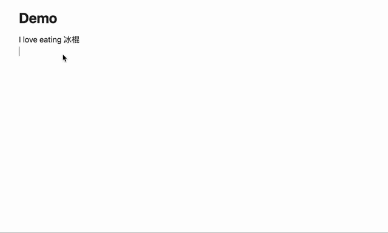

# Vibe Writing

A writing skills improvement assistant for Obsidian that helps you cultivate daily writing habits. Originally designed for English writing improvement for myself, Vibe Writing can be customized for any language through its flexible prompt system. Unlike typical AI writing tools that generate beautiful paragraphs for you, Vibe Writing focuses on identifying and enhancing the specific areas where your writing needs improvement.

**This is not an AI proxy - it's your personal writing coach.**

## Why Vibe Writing?

If you want to improve your writing skills through daily practice, you need feedback that helps you grow, not AI that writes for you. Vibe Writing analyzes your text and provides targeted suggestions to enhance your writing abilities, helping you become a better writer over time in any language you choose to practice.

## Demo

### Grammar & Typo Correction

Instantly fix grammar mistakes and typos in your writing. Simply select the text with errors, run the command, and get corrected text with clear highlighting of changes.

**Example:** "This is an big fish" → "This is a big fish"

### Mixed-Language Writing Assistant

When you don't know how to express certain words in your target language (like "冰棍" → "popsicle"), Vibe Writing helps you complete and improve your mixed-language sentences.

### 1. Main Writing Enhancement Pathway

**The core workflow for improving your writing skills:**

`Select your text` → `Call Vibe Writing improvement commands` → `AI responds with suggestions` → `Replace original text with enhanced version`

This is the primary way to enhance your writing skills. The AI analyzes your text and provides specific improvements that help you learn better writing patterns and techniques.

### 2. Create Your Own Custom Prompts

Customize the AI's feedback to focus on specific aspects of writing you want to improve:
- Grammar and syntax corrections
- Vocabulary enhancement suggestions
- Clarity and coherence improvements
- Style and tone adjustments
- Structure and flow optimization
- ...

Create personalized prompts that target your specific writing weaknesses and learning goals.

## Setup

1. Go to **Settings → Community Plugins → Vibe Writing**
2. **Add your API key** for your preferred AI provider:
   - OpenAI (GPT models)
   - Anthropic (Claude models)
   - Qwen (Alibaba's models)
3. **Choose your model** and adjust settings as needed
4. **Start writing** and use the commands to improve your text!

## Support the Project

If Vibe Writing helps improve your writing skills, consider supporting its development:

